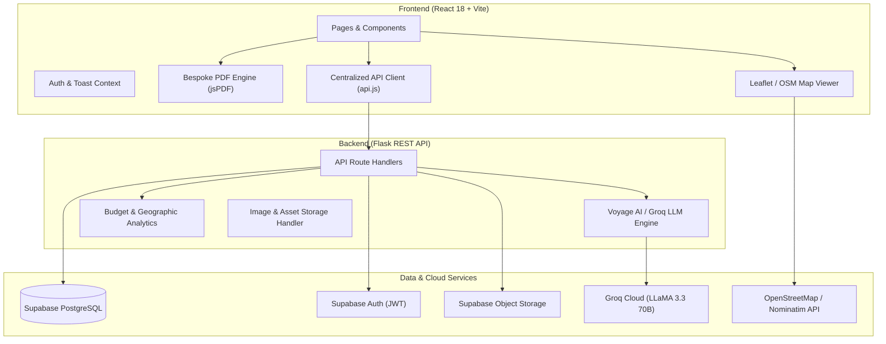

# GlobeTrotter — Intelligent Travel Itinerary & Budget Planner

> An intelligent, full-stack travel planning platform. GlobeTrotter combines dynamic day-by-day schedule builders, OpenStreetMap live geocoding, multi-destination financial analytics, and **Voyage AI** — a contextual AI travel concierge powered by Groq LLMs.

---

## Table of Contents
- [Key Features](#key-features)
- [System Architecture](#system-architecture)
- [Technology Stack](#technology-stack)
- [Core Workflows & User Journey](#core-workflows--user-journey)
- [API Endpoints Reference](#api-endpoints-reference)

---

## Key Features

### 1. Day-by-Day Schedule & Itinerary Planner
- **Multi-Day Schedule Builder**: Organize trips day by day with custom start and end dates.
- **Granular Activity Categories**: Dedicated quick-add drawers for:
  - **Stays & Hotels**: Check-in/out dates, price in INR (Rs.), and amenities.
  - **Flights & Transit**: Airline, flight number, departure/arrival cities and times, booking status, and PNR.
  - **Dining & Food**: Restaurants, cafes, food tours, and street food.
  - **Sightseeing & Monuments**: Landmarks, museums, and historic sites.
  - **Adventures & Activities**: Tours, hikes, excursions, and boat rides.
  - **Photo Memories & Notes**: Custom memory pins and notes.
- **Per-Day City Reassignment**: Customize and override destinations for individual days within a single journey (e.g., Day 1 in Tokyo, Day 3 in Kyoto).
- **Activity Reordering**: Shift activities earlier or later in the day with instant sync.
- **Interactive Calendar View**: Toggle between timeline view and a monthly calendar grid with category-coded activity pills.

### 2. Voyage AI — Intelligent Travel Concierge
- **Dedicated Concierge Experience**: Standout hero navigation in the sidebar leading to a full-screen AI advisor (`/ai`).
- **Context-Aware Grounding**: Seamlessly switch between global travel guidance and specific trip itineraries. The LLM receives the full active day-by-day plan, destinations, and dates to provide hyper-personalized recommendations.
- **1-Click Quick Action Chips**: Instant prompts for *Top Attractions*, *Food & Dining*, *3-Day Itinerary Generator*, and *Budget Optimization*.
- **Localized Financial Intelligence**: Automatically formats cost estimates in Indian Rupees (Rs.) with morning, afternoon, and evening time breakdowns.

### 3. Dual-Tier Financial & Budget Analytics
- **Trip-Specific Financial Analytics (`/trips/:tripId/budget`)**:
  - Category-wise distribution across Stays, Flights, Food, Sights, and Transit.
  - Multi-color segmented progress bar with real-time percentage shares.
  - **Target Budget vs. Actual Gauge**: Set a target budget (Rs.) with real-time progress bars and overbudget alert banners.
  - AI-generated financial insights and saving opportunities.
- **Global Cross-Trip Budget Dashboard (`/budget`)**:
  - **Geographic Location Spending Analysis**: Ranked horizontal bar graph showing where money is being spent by city and destination (e.g., Ahmedabad vs. Goa vs. Paris).
  - Cross-itinerary cost comparison cards.
  - Filterable, searchable itemized expense ledger across all journeys.

### 4. Public Sharing & 1-Click Itinerary Cloning
- **Public Visibility Switch**: Toggle itineraries between Private and Public mode.
- **Public Read-Only View (`/public/trips/:tripId`)**: Clean, unauthenticated shareable view with cover photos, badge summaries, and day-by-day timeline.
- **Copy to My Trips**: Logged-in viewers can clone any public itinerary into their account with 1 click, preserving all days, stops, and scheduled activities.

### 5. Bespoke Luxury PDF Export
- **One-Click Itinerary PDF Generator**: High-resolution, printable PDF export styled with GlobeTrotter's signature warm charcoal and yellow-gold design palette.
- **Structured Tabular Layout**: Includes day headers, category badges, location tags, notes, itemized costs, and daily/overall budget subtotals.

### 6. Live Maps & OpenStreetMap Discovery
- **Leaflet & OpenStreetMap Integration**: Real-time geocoding of trip destinations and day stops.
- **Interactive Map Markers**: Visualizes route connections, day pins, and planned stops on an interactive map.
- **Curated & Live Discovery**: Browse attractions, dining spots, and activities by city with one-click "Add to Trip" actions.

---

## System Architecture

---

## Technology Stack

### Frontend
- **Framework**: React 18 with Vite
- **Routing**: React Router v6
- **Styling**: Vanilla CSS Design System with CSS variables (no Tailwind dependency), custom micro-animations, glassmorphism, and dark/warm themes
- **Mapping & Geocoding**: Leaflet, React Leaflet, OpenStreetMap Nominatim
- **PDF Generation**: jsPDF & jsPDF-AutoTable
- **Icons**: Custom SVG vector icon suite

### Backend
- **Framework**: Python 3 with Flask
- **Database Client**: Supabase Python SDK
- **AI / LLM**: Groq Python SDK running `llama-3.3-70b-versatile`
- **CORS & Auth**: `flask-cors`, Bearer JWT validation with Supabase Auth

### Database & Cloud Services
- **Database**: Supabase (Managed PostgreSQL with Row Level Security)
- **Authentication**: Supabase Email & Password Auth
- **Storage**: Supabase Storage Buckets for trip cover photos and assets

---

## Core Workflows & User Journey

### 1. Create a Trip
1. Navigate to **Plan a New Trip** (`/trips/new`).
2. Input the destination city (e.g., Goa, Paris, Tokyo), trip dates, optional target budget in Rs., and cover photo URL.
3. The platform creates the trip and initializes the dynamic day sequence.

### 2. Schedule Day-by-Day Activities
1. In the **Day Planner** (`/trips/:tripId/builder`), select any day.
2. Click **Place**, **Food**, **Stay**, **Flight**, or **Adventure** to open the quick-add drawer.
3. Fill in name, timing, cost, and notes. The activity instantly updates the schedule, map pins, and budget subtotals.
4. Reorder activities with the Up and Down arrow buttons or switch destinations per day.

### 3. Ask Voyage AI for Concierge Advice
1. Click **Voyage AI** in the sidebar.
2. Select your active trip in the context dropdown.
3. Click a quick prompt (e.g., "Must-Try Local Food" or "3-Day Itinerary") or type custom requests.
4. Voyage AI analyzes your scheduled days and returns structured, actionable suggestions in Rs.

### 4. Financial Tracking & Analytics
1. Open **Budget** for the trip to inspect category spending, daily spend averages, and target budget progress.
2. Visit **Global Budget** (`/budget`) to view geographic expenditure charts comparing costs across all destinations.

### 5. Export & Share
1. Click **Export PDF** to generate an itemized, printable travel booklet.
2. Toggle **Public** to share your live itinerary link with friends, allowing them to view or clone it.

---

## API Endpoints Reference

### Trips
| Method | Endpoint | Description | Auth Required |
| :--- | :--- | :--- | :---: |
| `GET` | `/api/trips` | List all trips for current user | Yes |
| `POST` | `/api/trips` | Create a new trip | Yes |
| `GET` | `/api/trips/<id>` | Get trip details with stops and items | Yes |
| `PUT` | `/api/trips/<id>` | Update trip metadata, dates, or visibility | Yes |
| `DELETE` | `/api/trips/<id>` | Delete a trip | Yes |
| `POST` | `/api/trips/<id>/duplicate` | Clone a trip and all its day items | Yes |
| `GET` | `/api/public/trips/<id>` | Read-only public itinerary view | No |
| `POST` | `/api/trips/<id>/cover` | Upload cover photo to storage | Yes |

### Day-by-Day Planning
| Method | Endpoint | Description | Auth Required |
| :--- | :--- | :--- | :---: |
| `GET` | `/api/trips/<id>/days` | Get full day breakdown and scheduled items | Yes |
| `POST` | `/api/trips/<id>/days/<date>/items` | Add a scheduled activity/stay/flight | Yes |
| `PUT` | `/api/day-items/<id>` | Update item details, notes, or order index | Yes |
| `DELETE` | `/api/day-items/<id>` | Remove a day item | Yes |

### Budget & Analytics
| Method | Endpoint | Description | Auth Required |
| :--- | :--- | :--- | :---: |
| `GET` | `/api/trips/<id>/budget` | Category breakdown & AI financial insights | Yes |

### Voyage AI & Discovery
| Method | Endpoint | Description | Auth Required |
| :--- | :--- | :--- | :---: |
| `POST` | `/api/chat` | Voyage AI concierge chat with trip grounding | Yes |
| `GET` | `/api/places/search` | Search places by city and category | Yes |
| `GET` | `/api/saves` | List bookmarked places | Yes |
| `POST` | `/api/saves` | Save a place to bookmarks | Yes |
| `DELETE` | `/api/saves/<id>` | Remove a bookmarked place | Yes |

---

## License
This project was created for the hackathon. Feel free to use and adapt it for your travel adventures.
