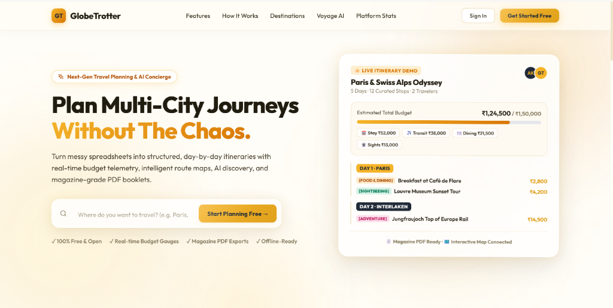
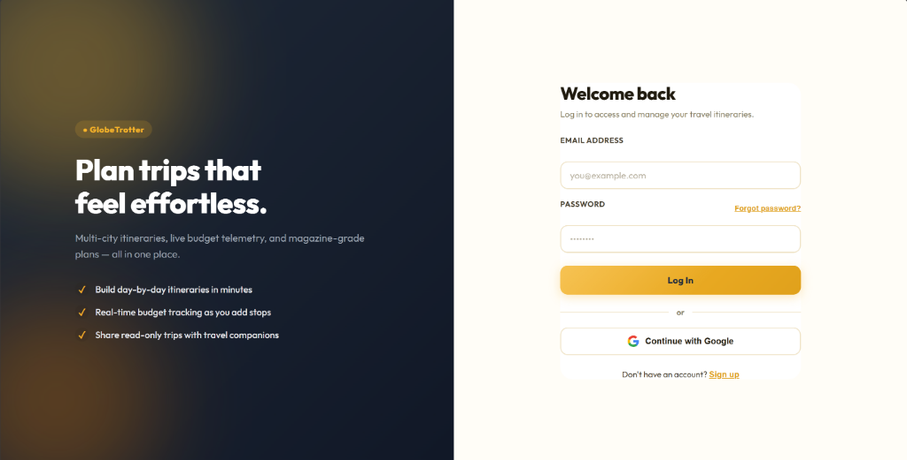
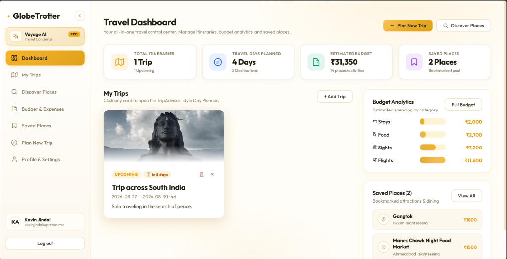
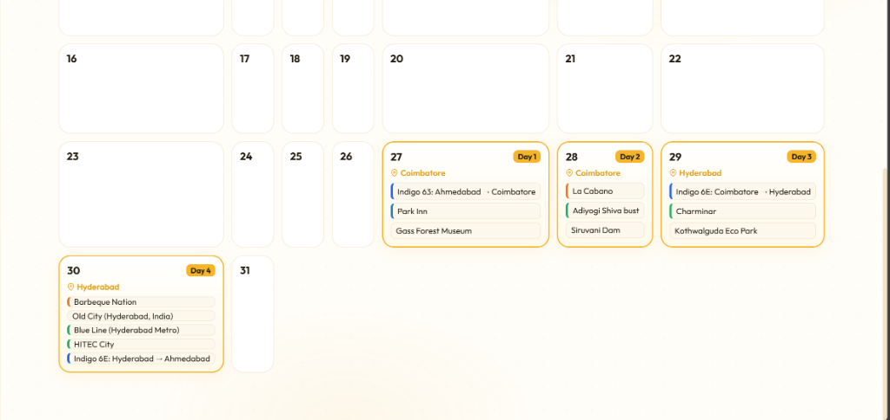
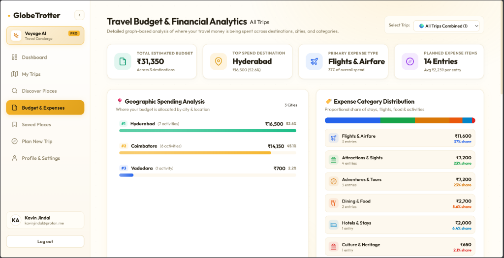
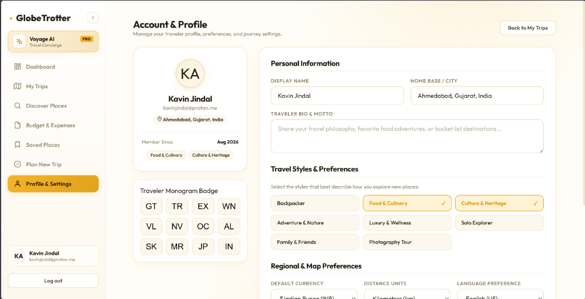
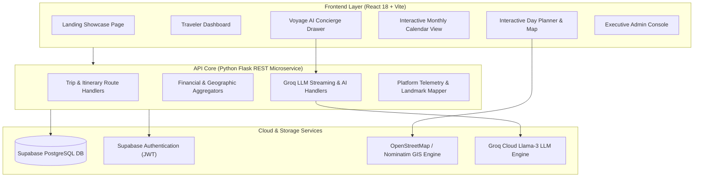

<div align="center">


# GlobeTrotter

### Intelligent Multi-City Itinerary Architect & AI Travel Concierge

**Built with pride for the Odoo x LDCE Hackathon 2026**

[](https://reactjs.org/)
[](https://vitejs.dev/)
[](https://python.org/)
[](https://flask.palletsprojects.com/)
[](https://supabase.com/)
[](https://groq.com/)
[](https://www.openstreetmap.org/)

---

</div>

## Executive Overview

**GlobeTrotter** is a modern, full-stack travel intelligence platform engineered to eliminate the fragmentation and friction of multi-city journey planning. Built for the **Odoo x LDCE Hackathon**, it combines real-time geographic discovery, dynamic day-by-day route sequencing, AI travel concierges, multi-currency budget optimizers, public community sharing, and standalone executive telemetry in a single, glassmorphic web application.

---

## Team Members & Hackathon Attribution

> **Event**: Built for Odoo x LDCE Hackathon 2026

- **Kavin Jindal**
- **Sarthakk Anjariya**
- **Pooja Teotia**
- **Ishita Mehta**

---

## Sample Itinerary PDF Export

Experience the magazine-grade offline travel booklet generated directly by GlobeTrotter:

📄 **[Download & View Sample Itinerary PDF (Trip Across South India)](assets/Trip_across_South_India_Itinerary.pdf)**

---

## Visual Showcase & Screenshots

### 1. Landing Page & Value Proposition
*Modern hero presentation showcasing live interactive itinerary demos, quick destination searches, and core feature pillars.*



---

### 2. Authentication & Secure Gateway
*Streamlined authentication interface supporting secure email/password login and Supabase OAuth integration.*



---

### 3. Traveler Control Dashboard
*Central control center displaying upcoming itineraries, countdown telemetry, financial summary widgets, and bookmarked place stash.*



---

### 4. Interactive Monthly Travel Calendar
*Full-month visual planner highlighting scheduled trip dates, destination tags, flights, stays, food spots, and daily activity pills with 1-click day navigation.*



---

### 5. Travel Budget & Financial Analytics
*Deep financial telemetry providing geographic spending analysis across destinations and proportional category distribution.*



---

### 6. Traveler Profile & Preferences
*Personalized traveler hub featuring custom monogram badge selection, travel style toggles, and regional currency settings.*



---

### 7. Executive Administration & Platform Telemetry
*Dedicated `/admin` management console featuring 6-month growth trajectories, weekly engagement bar charts, and destination rankings.*


---

## Key Capabilities & System Features

### 1. Interactive Multi-City Day Planner & Calendar
- **Dynamic Timeline Sequencing**: Build granular day-by-day travel schedules with sequential stops and time slot scheduling.
- **Monthly Interactive Calendar**: Full-calendar overview mapping multi-city spans, airline transit legs, and day cards.
- **Categorized Drawers**: Seamlessly manage 7 experience categories: *Sightseeing*, *Food & Dining*, *Stays & Hotels*, *Flights & Transit*, *Adventures*, *Culture & Arts*, and *Notes*.
- **Interactive GIS Map Visualization**: Real-time Leaflet & OpenStreetMap view rendering route polylines and interactive pin markers with popup details.

### 2. Voyage AI Concierge
- **Context-Aware Assistance**: Powered by Groq high-throughput LLMs to suggest custom day plans, packing recommendations, budget advice, and local food spots.
- **1-Click Itinerary Insertion**: Add AI-recommended attractions and activities directly into active travel itineraries.

### 3. Smart Discovery & Global Stash
- **Live Place Discovery**: Real-time place searches by city and category with Wikipedia imagery, tags, ratings, and estimated costs in INR (₹).
- **Global Saved Places Pool**: Save places across searches into a persistent personal stash for later itinerary assignment.

### 4. Financial Telemetry & Budget Optimization
- **Per-Trip Budget Tracking**: Compare planned costs against target budgets with color-coded alerts and category breakdown gauges.
- **Global Multi-Trip Analytics**: Cross-itinerary expense comparisons, average daily spend tracking, and multi-currency converter (INR, USD, EUR, GBP, JPY, AED).

### 5. Community Sharing & Export Engine
- **Read-Only Public URLs**: Frictionless itinerary sharing with 1-click WhatsApp, X, and link copy buttons.
- **Magazine-Quality PDF Export**: Formatted printable itinerary booklets for offline access.

### 6. Executive Administration & Live Telemetry Console
- **Dedicated Standalone Gateway**: Secure access control at `/admin` (Passkey: `admin2026`).
- **Telemetry Visualizations**: 6-Month Itinerary Trajectory Area Charts, Weekly Traveler Activity Bar Charts, Interactive Category Expenditure Donut, and Geographic Destination Rankings.

---

## System Architecture



---

## Technology Stack

| Domain | Technology | Specification & Usage |
| :--- | :--- | :--- |
| **Frontend UI** | React 18 + Vite | Declarative component hierarchy with fast HMR |
| **Design System** | Custom Vanilla CSS | Glassmorphism, warm ambient background gradients, Outfit / Plus Jakarta Sans typography |
| **Mapping Engine** | Leaflet + OpenStreetMap | Interactive GIS map with coordinate bounds and polyline routes |
| **Backend REST API** | Python 3 / Flask | Lightweight microservice handling CRUD, calculations, and analytics |
| **Database & Auth** | Supabase PostgreSQL | Managed database with Row Level Security (RLS) and JWT auth |
| **AI LLM Pipeline** | Groq SDK (Llama-3-70B) | High-speed, context-aware itinerary and travel recommendations |
| **Document Export** | jsPDF & HTML2Canvas | Formatted offline PDF travel booklets |

---

## Directory Structure

```
globetrotter/
├── assets/                  # Brand assets, project logo, screenshots & sample PDF
│   ├── logo.png
│   ├── Trip_across_South_India_Itinerary.pdf
│   └── screenshots/
│       ├── 01_landing_page.png
│       ├── 02_login_auth.png
│       ├── 03_travel_dashboard.png
│       ├── 04_calendar_itinerary_view.png
│       ├── 04_budget_financial_analytics.png
│       ├── 05_profile_settings.png
│       └── 06_admin_analytics.png
├── backend/                 # Python Flask REST API
│   ├── app.py               # Main Flask server & route handlers
│   ├── requirements.txt     # Backend dependencies
│   └── .env.example         # Environment template
├── frontend/                # React 18 + Vite application
│   ├── src/
│   │   ├── components/      # UI components (TripMap, Icons, AIChatDrawer)
│   │   ├── pages/           # Application views (DayPlanner, AdminAnalytics, etc.)
│   │   ├── context/         # React Context providers (ToastContext)
│   │   ├── api.js           # Centralized API client with in-memory caching
│   │   ├── supabaseClient.js# Supabase client configuration
│   │   └── index.css        # Global design system & theme tokens
│   ├── public/              # Static public assets (logo.png, favicon.png)
│   ├── package.json         # Node dependencies & build scripts
│   └── vite.config.js       # Vite configuration with vendor code-splitting
└── README.md                # Project documentation
```

---

## Quick Start Guide

### 1. Prerequisites
- **Node.js**: v18.0 or higher
- **Python**: v3.9 or higher
- **Supabase Account & Groq API Key**

### 2. Backend Setup
```bash
cd backend
python -m venv venv
# Windows:
venv\Scripts\activate
# Linux/macOS:
source venv/bin/activate

pip install -r requirements.txt
python app.py
```
*Backend runs locally on `http://127.0.0.1:5000`.*

### 3. Frontend Setup
```bash
cd frontend
npm install
npm run dev
```
*Frontend runs locally on `http://localhost:5173`.*

---

## License & Acknowledgements

Created with ❤️ by **Kavin Jindal**, **Sarthakk Anjariya**, **Pooja Teotia**, and **Ishita Mehta** for the **Odoo x LDCE Hackathon 2026**.
