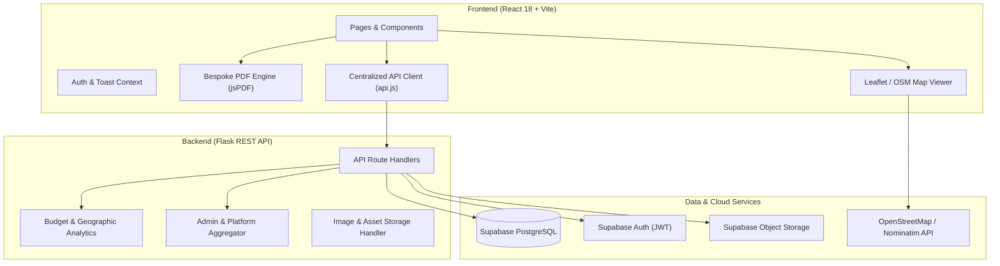

# GlobeTrotter — Intelligent Travel Itinerary & Budget Planner

> An intelligent, full-stack travel planning platform built for the Odoo Hackathon. GlobeTrotter combines dynamic multi-city schedule builders, OpenStreetMap live geocoding, multi-destination financial telemetry, luxury PDF exports, and AI-assisted travel discovery.

---

## Table of Contents
- [Platform Overview & Feature Matrix](#platform-overview--feature-matrix)
- [System Architecture](#system-architecture)
- [Technology Stack](#technology-stack)
- [Core Workflows & User Journey](#core-workflows--user-journey)
- [License](#license)

---

## Platform Overview & Feature Matrix

| Module | Feature Name | Core Functionality | UI Route |
| :--- | :--- | :--- | :--- |
| **Authentication** | Login & User Management | Email/password login, account registration, password reset recovery, profile customization. | `/login`, `/profile` |
| **Landing Page** | Luxury Welcome Portal | Glassmorphic hero showcase, live interactive itinerary demo, and quick trip launcher. | `/`, `/landing` |
| **Dashboard** | Traveler Hub | Overview of active trips, recommended destinations, quick actions, and expense highlights. | `/dashboard` |
| **Trip Management** | Multi-City Itinerary Index | Searchable trip cards, duration counters, duplication, edit, and deletion actions. | `/trips` |
| **Trip Creation** | Journey Canvas Setup | Destination selection, start & end dates, target budget in INR (Rs.), and cover photos. | `/trips/new` |
| **Itinerary Builder** | Day-by-Day Day Planner | Granular drawers for stays, flights, food, sightseeing, and adventures with stop reordering. | `/trips/:id/builder` |
| **Itinerary View** | Structured Timeline | Chronological view with day capsules, city badges, time slots, and calendar mode switch. | `/trips/:id/view` |
| **Discovery Engine** | Places & Attractions Search | Live OpenStreetMap geocoding, category filters (Food, Sights, Adventure), and place cards. | `/discover` |
| **Budget Telemetry** | Single-Trip Expense Tracking | Category distribution (Stays, Flights, Food, Sights), target budget gauge, and overbudget alerts. | `/trips/:id/budget` |
| **Global Analytics** | Cross-Trip Financials | Geographic city spend bar chart, cross-itinerary cost ledger, and average daily spend. | `/budget` |
| **Public Sharing** | Community Sharing & Cloning | Read-only public URLs, social sharing (WhatsApp, X, Link), and 1-click itinerary duplication. | `/public/trips/:id` |
| **Bespoke Exports** | Magazine-Style PDF Booklets | Dedicated luxury cover page, alternating day capsules, and explicit category badges. | *Export Action* |
| **Admin Portal** | Platform Adoption Analytics | System-wide trip counts, total travel days, category distribution, and top destination rankings. | `/admin` |

---

## System Architecture

---

## Technology Stack

| Layer | Technology | Purpose | Key Libraries & Specifications |
| :--- | :--- | :--- | :--- |
| **Frontend Framework** | React 18 | Declarative component hierarchy and dynamic state management | Vite, React Router v6 |
| **Styling & Design** | Vanilla CSS3 | Custom design system, glassmorphism, floating micro-animations | Outfit typography, CSS variables |
| **Mapping & GIS** | Leaflet & OpenStreetMap | Real-time geocoding, interactive pin markers, and route display | React-Leaflet, Nominatim API |
| **Document Generation**| jsPDF | Swiss/Paris luxury editorial PDF itinerary booklets | jsPDF, AutoTable |
| **Backend Framework** | Python 3 / Flask | RESTful API endpoints, data validation, and calculation engines | Flask, Flask-CORS, Gunicorn |
| **Database & Auth** | Supabase | Managed PostgreSQL with Row-Level Security and JWT Auth | Supabase Python SDK |
| **Asset Storage** | Supabase Storage | Cloud object storage for trip cover photography | Public CDN buckets |

---

## Core Workflows & User Journey

| Workflow | Entry Point | User Actions | Expected Output |
| :--- | :--- | :--- | :--- |
| **1. Create Itinerary** | `/trips/new` | Enter destination city, travel date span, optional budget target, and cover image. | Initializes trip record and generates sequential day schedule. |
| **2. Schedule Activities**| `/trips/:id/builder` | Open category drawers (Stay, Flight, Food, Sights, Adventure) to add items. | Schedule timeline, map markers, and itemized costs update in real time. |
| **3. Financial Telemetry** | `/trips/:id/budget` | Set target budget and track category breakdown across transport, stay, food, sights. | Live progress gauges, overbudget alerts, and daily spend averages. |
| **4. Global Analytics** | `/budget` | Review geographic bar chart comparing spending across Ahmedabad, Goa, Paris, etc. | Aggregated cost comparison and searchable cross-trip ledger. |
| **5. PDF Booklets** | `/trips` or Planner | Click PDF Export trigger on any active trip card. | Multi-page luxury itinerary booklet with cover page and category badges. |
| **6. Share & Clone** | `/public/trips/:id` | Publish trip publicly and share via WhatsApp, X, or direct link. | Read-only view with 1-click "Copy to My Trips" cloning for other users. |
| **7. Platform Admin** | `/admin` | Enter master administrator passkey to view platform adoption stats. | Executive dashboard with top destinations, travel day counts, and platform ledger. |

---

## License
Built for the Odoo Hackathon. Empowering personalized, intelligent, and collaborative travel planning.
